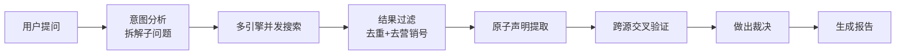

# 我用 LangGraph 搭了个"反谣言"引擎

去年有段时间，我频繁用 ChatGPT 查一些需要验证真伪的信息——某家公司的融资传闻、某个技术方案的优劣对比。每次看完回答我都会想同一个问题：**这东西到底靠不靠谱？**

模型说得头头是道，引经据典，但你根本不知道它引用的是真实报道还是凭空编的。更坑的是，当你追问"这个数据来源是哪里"，它可能给你一个看起来很真的假链接。

后来我发现，这个问题用简单的"搜索+总结"解决不了。因为真正难的不是搜到信息，而是**判断信息的可信度**。同一个事件，A 媒体报道"融资 5 亿"，B 博客写"融资 2 亿"，C 论坛说"根本没融到"。你怎么让 AI 区分哪个可信、哪个是软文、哪个是纯编？

**这就是 TruthSeeker 的起点。** 我不是 AI 研究员，我是一个前端背景的工程师。但我觉得这个问题值得认真做一做——与其每次都手动去 google 核实，不如搭个工具帮我自动干这件事。

## 它到底做什么？

简单说，TruthSeeker 就是：你提一个问题，它去全网搜，然后把不同来源的说法摆在一起对比，告诉你哪些是真的、哪些是矛盾的、哪些根本没法验证。

不追求"给你一个答案"，而是追求"告诉你这个答案可信吗"。

举个例子。你问"Neuralink 首例人体植入后受试者出现感染，真的假的？"它会：

1. 把你的问题拆成几个子问题：植入时间、受试者状态、感染报告来源
2. 同时去多个搜索引擎搜（博查、Tavily、知乎）
3. 把所有搜到的网页里的事实拆成"原子声明"——比如"手术于 2024 年 1 月完成"
4. 对每条声明，检查有多少来源在说同样的事，这些来源靠谱吗
5. 最终给你一份报告：哪些事实被多个权威信源证实，哪些只有一个来源在传，哪些来源之间互相矛盾

整个过程大概像这样：

核心跟普通搜索的区别在于那个**交叉验证环节**——我后来管它叫"审判室"。后面第 4 篇会专门讲。

## 四个模式，不同深度

不是所有问题都需要这么重的流程。你问"今天天气多少度"显然不需要多源验证。所以做了四个档位：

| 模式 | 适合场景 | 大概耗时 |
|------|----------|----------|
| 极速快问 | 简单确认，比如查一个价格 | 几秒 |
| 专家搜索 | 深入了解一个主题 | 几十秒 |
| 深度研究 | 复杂问题、需要多源验证 | 几分钟 |
| 智能模式 | 让 AI 自己判断该用哪个 | 自适应 |

## 技术栈

因为这个项目前后端都是我一个人在写，选型上有个很现实的原则：**尽量选我熟悉的，不熟的只挑最主流的那一个。**

| 层 | 选了啥 | 为什么 |
|----|--------|--------|
| 后端 | Python + FastAPI | 虽然我是前端，但 Python 上手快，FastAPI 文档好 |
| AI 编排 | LangGraph | 当时 LangChain 生态最成熟的状态机方案，没做太多对比就选了 |
| 前端 | Next.js 16 | 老本行，闭眼选 |
| 数据库 | PostgreSQL + Redis | PG 存业务数据，Redis 做缓存和任务队列 |
| 部署 | Docker Compose | 一个人运维，K8s 太重了 |

## 这个项目的特殊性

这可能是最不典型的"一人项目"：它涉及后端、AI 编排、数据库设计、Worker 调度、安全加密、前端交互、部署运维——每一层都是浅尝辄止，但每一层都得做。

后面 8 篇文章，我会逐一拆解每个模块的设计决策、踩过的坑、以及做完之后回头看觉得哪里该重写。

---

> **已知不足**（POC 阶段）：整个项目目前只有我一个人在业余时间维护，很多模块还停在"能跑就行"的阶段。交叉验证的准确率受限于搜索引擎返回质量和通用 LLM 的推理能力，没有专门微调模型。如果有预算和团队，最想做的事是给验证环节做一个专门的评估数据集，然后基于反馈持续优化 Prompt。

---

> **下一篇**：[一个前端写 Python 后端，技术选型的纠结 →](/blog/truthseeker/02-core-architecture)