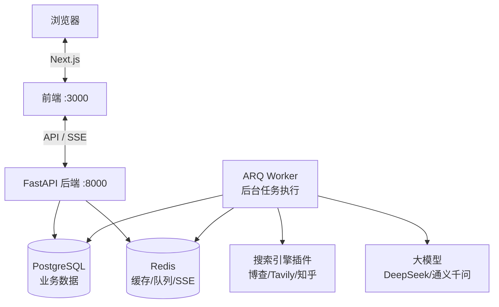
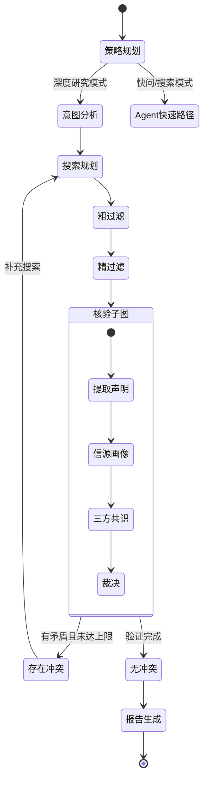
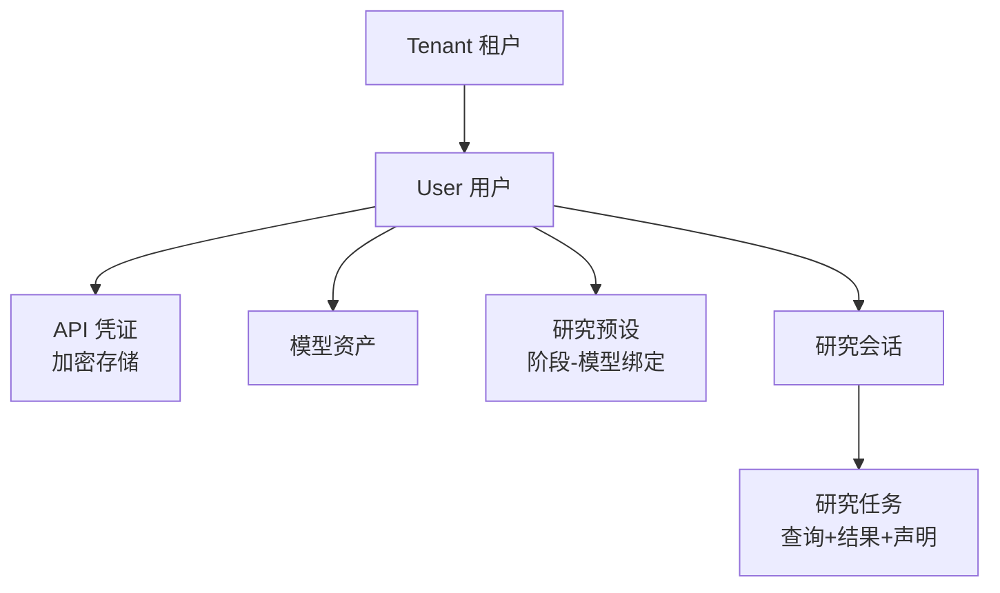
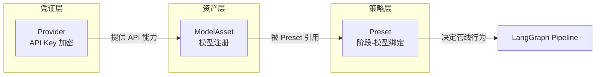

# 一个前端写 Python 后端，技术选型的纠结

我一个写了七八年 JavaScript 的人，突然要搭一个 Python 后端的 AI 项目，说实话一开始是有点抗拒的。但 LLM 生态最好的工具链全在 Python 侧——LangChain、LangGraph、FastAPI——这是现实，没什么好纠结的。

真正纠结的是**具体选什么**。Python 后端框架一大堆，AI 编排框架也在井喷期。这篇记录我的选型过程和回头看觉得对/错的地方。

## 整体架构怎么搭的

开始画图之前先交代下思路。这个系统大概分三块：用户交互的前端、处理请求的后端、以及真正干活的 Worker 进程。为什么要把后端和 Worker 拆开？因为深度研究要跑几分钟，不能让 HTTP 请求一直挂着等——后端收到请求就丢进队列，Worker 在后台慢慢跑，结果通过 SSE 实时推回去。

## 为什么是 FastAPI 不是 Django？

Django 太重了。这个项目需要的是：路由层、中间件、异步支持、SSE 流式响应。不需要 ORM 自带的后台管理、不需要模板引擎、不需要表单验证——这些我前端都自己做了。

FastAPI 的好处：

- 原生 async/await，跟 LangGraph 的异步执行天然匹配
- Pydantic 做请求校验，跟 LangChain 的类型系统一路
- Swagger UI 自动生成，调试 API 很方便
- 启动快，Docker 镜像小

**后悔的：** FastAPI 的依赖注入系统一开始用得很爽，但项目大了以后到处 `Depends()` 让调用链很难追踪。如果有下次，我会把业务逻辑更多放在 service 层，路由只做参数校验和转发。

## 为什么是 LangGraph 不是纯 LangChain 或别的？

这个问题值得展开。刚开始我用的是 LangChain 的 `LLMChain`，就是最简单的"给一个 Prompt，拿一个回答"。很快发现两个问题：

1. **流程不可控**。研究需要多步走（意图分析 → 搜索 → 验证 → 报告），不是一次 LLM 调用能搞定的。用 Chain 串联虽然能做，但中间状态断了就全丢了。
2. **需要循环**。验证发现信源矛盾，得回头重新搜索。这种"条件路由+循环"在 LangChain 里写起来很痛苦。

LangGraph 解决的是这两个问题：它把整个流程定义成一个**状态机**，每个节点是独立的处理步骤，节点之间可以条件跳转，而且每一步的状态自动持久化——等于自带断点续传。

画出来大概这样：

**当时没对比的：** 现在回头看，应该对比一下 LangFlow（可视化编排）和 Haystack。但当时 LangGraph 文档最全、例子最多，就它了。这不算错，但算偷懒。

## 数据库：PostgreSQL 还是继续 SQLite？

本地开发一直用的 SQLite（`sqlite+aiosqlite`），不需要装任何东西，`pip install` 完就能跑。但 SQLite 有个致命问题：**并发写入锁**。当 Worker 在写研究结果、同时 API 在查历史记录，SQLite 的写锁会导致读超时。

所以生产环境切到了 PostgreSQL。好处明显：真并发、有连接池、Alembic 迁移支持好。代价是 Docker Compose 多一个服务、部署多一步。

**教训：** 如果一开始就知道要上生产，直接 PG 起步。SQLite 到 PG 的迁移虽然 Alembic 能搞定，但一些 SQLAlchemy 的异步用法在两个数据库上行为不一致，调试花了时间。

### 迁移工具为什么选 Alembic

[Alembic](https://alembic.sqlalchemy.org/) 是 SQLAlchemy 官方的数据库迁移工具，它是 Python 生态里管数据库 schema 版本的标准答案。跟手写 SQL 迁移脚本相比，Alembic 有几个关键好处：

1. **自动生成迁移脚本。** 你改了 SQLAlchemy 的 Model 定义（比如给 `ResearchTask` 加了个字段），一条 `alembic revision --autogenerate` 就能生成对应的 `ALTER TABLE` 迁移。不用自己写 SQL，不容易出错。
2. **版本管理和回滚。** 每次迁移是一个版本文件，像 Git commit 一样有历史。`alembic upgrade` 向前、`alembic downgrade` 回退。部署出错时可以快速回滚 schema，不用手动改数据库。
3. **跟 Docker Compose 的配合。** 应用容器启动时先跑 `alembic upgrade head`，把 schema 更新到最新版本，然后再启动 FastAPI/Worker。这保证了部署时 schema 和应用代码永远对齐。

POC 阶段我的 Alembic 配置很基础——就一个 `alembic.ini` 加一个 `env.py`，迁移脚本也没认真管理分支。生产环境的话应该把迁移脚本纳入 CI 检查，确保每个 PR 的 schema 变更都有对应的迁移文件。

### 再说说 Redis 在架构里的角色

Redis 在这个项目里其实干了三件事，这是一个之前反复纠结后做的取舍——到底引入一个独立的消息队列（比如 RabbitMQ），还是让 Redis 扛所有。

| 角色 | 怎么用的 | 为什么用 Redis 而不是别的 |
|------|----------|--------------------------|
| **任务队列** | Worker 通过 Redis List (`BRPOP`) 拉取待处理的研究任务 | Redis List 的阻塞弹出天然支持优先级队列，不需要额外安装 RabbitMQ |
| **SSE 发布/订阅** | Worker 通过 Redis PubSub 实时推送研究进度给 API 进程 | PubSub 的延迟接近零，适合实时事件推送 |
| **缓存** | LLM 的重复请求结果缓存、用户 Token 的黑名单缓存 | 内存读写比 PG 快两个数量级 |

用 Redis 扛三个角色最大的好处是**运维一致**——Docker Compose 里只多一个服务，不用同时维护 Redis 和 RabbitMQ 两套中间件。代价是 Redis 的 PubSub 不保证消息送达（断线就丢消息），后面第 8 篇会讲怎么用 Redis Stream 补救这个问题。

## 数据怎么组织的

这个项目是多租户的——多个用户各自配自己的 API Key、各自的模型策略、各自的研究记录互不可见。所以数据模型设计上最关键的是**隔离**，不是性能。

每一层通过外键级联，`ON DELETE CASCADE` 确保删用户时不留孤儿数据。实现上所有查询都带 `WHERE tenant_id = ? AND user_id = ?`，API 层从 JWT 里提取 user_id 注入。

## 配置的三层模型

这个东西花了我最长时间想清楚。用户的 API Key、用户的模型列表、用户的研究策略——这三样东西不能混在一起存。

比如：用户配了 DeepSeek 的 API Key（凭证层），注册了 `deepseek-chat` 和 `deepseek-reasoner` 两个模型（资产层），然后创建一个 Preset 说"意图分析用 chat 模型、验证用 reasoner 模型"（策略层）。三层解耦后，换 API Key 不需要重配策略，加新模型也不需要改预设。

---

> **已知不足**（POC 阶段）：选型上没做过系统性的框架对比——LangGraph vs Haystack vs 自建状态机，FastAPI vs Litestar，都是凭直觉和文档质量选的。数据库查询还有很多 N+1 问题，没来得及加 Redis 缓存层来减少 PG 压力。实体模型设计偏保守，比如 ResearchTask 一个表扛了太多字段，后续应该拆表。如果有团队，架构评审这关肯定要补。

---

> **上一篇**：[我用 LangGraph 搭了个"反谣言"引擎 ←](/blog/truthseeker/01-product-overview)
> **下一篇**：[LangGraph 管道：我把研究拆成了 6 个工人 →](/blog/truthseeker/03-langgraph-pipeline)