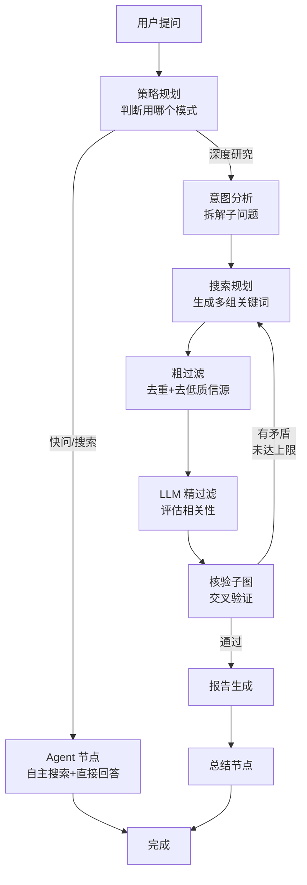
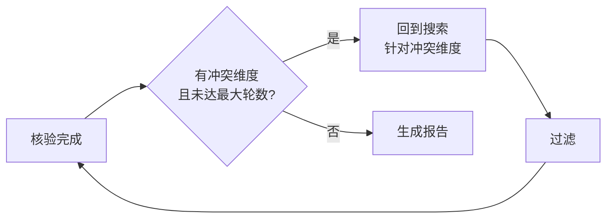

# LangGraph 管道：我把研究拆成了 6 个工人

上一篇文章讲了为什么选 LangGraph。这篇讲实际怎么用的——把"做深度研究"这件事，拆成几个独立的步骤，每个步骤是一个节点，连起来就是一个状态机。

## 一开始我想得太简单了

最初的版本极其朴素：用户提问 → 搜索 → 把搜索结果喂给 LLM → 生成回答。十几个 `LLMChain` 串起来，跑得动，但问题一大堆：

1. **中间结果丢了。** 搜索返回了 20 条结果，过滤后剩 8 条，验证到一半报错——你得从头再跑。没有状态保存。
2. **没法回头。** 验证阶段发现某个维度证据不足，想追加搜索？做不到。管道是单向的。
3. **一个模型干所有事。** 搜索、分析、验证、写报告全用同一个模型、同一个温度参数。搜索需要创意（高温度）、验证需要严谨（低温度），没法区分。

所以后来彻底重构成了 LangGraph 的 `StateGraph`。

## 现在的管道长什么样

我把整个研究拆成了这些节点，每个节点干一件事：



说一下几个有意思的节点。

### 意图分析：把模糊问题变具体

用户经常问得很笼统，比如"AI 对就业的影响"。这个节点做的事就是把这种问题拆成可搜索的子问题：

- AI 替代了哪些岗位？有没有统计数据？
- AI 创造了哪些新职业？
- 各国政府怎么应对的？
- 学术界主流观点是什么？

拆完之后用向量相似度去重——防止"AI 替代岗位"和"AI 导致失业"这种同义拆解浪费搜索次数。

**踩坑：** 早期版本没有去重，同一个意思的不同表述各自搜了一轮，浪费 API 调用额度。一个 DeepSeek 的搜索 API 调用不贵，但深度研究模式一轮最多搜 3 轮 × 6 个维度 × 多引擎，累计下来还是挺心疼的。

### 向量去重用的是什么模型

向量去重需要把每个子问题转换成一个向量（Embedding），然后算余弦相似度。我用的是阿里云的 **通义 Embedding Vision Flash**（`tongyi-embedding-vision-flash`）——这是通义千问系列里一个轻量化的多模态 Embedding 模型，基于 Qwen3 底座。

虽然它原生支持文本、图像、视频三种模态，但我在 TruthSeeker 里只用了它的文本 Embedding 能力。选它的理由：

1. **中文理解强。** 通义系列在中文语义理解上一直很稳，比同级别的开源 embedding 模型（如 MiniLM、BGE 等）对中文短语和口语化表达的向量表示更准确。同样是"AI 替代岗位"和"AI 导致失业"这种同义判断，通义的相似度打分明显更符合直觉。
2. **多维度可选。** 支持多种输出维度，按需选——我只是做语义去重，256 维就够。维度小意味着算余弦相似度更快、存向量更省内存。
3. **高性价比。** 作为 DashScope API 的一部分，调用价格很低。每次研究最多拆出 6 个维度，几十次 embedding 调用几乎可以忽略不计。
4. **跟 DeepSeek 统一接入。** 两个都在阿里云 DashScope 网关下，用同一套 SDK、同一个 API Key、同一种调用方式。不用额外维护另一套 API 凭证。

调用方式很简单，通过 DashScope SDK：

```python
from dashscope import TextEmbedding

resp = TextEmbedding.call(
    model="tongyi-embedding-vision-flash",
    input=["AI 替代了哪些岗位？", "AI 导致失业了吗？"],
    dimension=256  # 用 256 维，去重够用
)
embeddings = [item['embedding'] for item in resp.output['embeddings']]
```

拿到向量后用 `sklearn` 的 `cosine_similarity` 算相似度，超过 0.85 的判定为同义重复。整个去重逻辑不超过二十行。


### 过滤：两级过滤，先快后慢

搜索结果动辄几十条，不能全丢给 LLM 去读——太慢也太贵。所以拆成两步：

1. **粗过滤**：基于规则的，去重 URL、去明显低质域名、去太短的摘要
2. **LLM 精过滤**：把粗筛后的结果给 LLM，让它判断"这条内容跟研究主题相关吗？信息密度够吗？"

**效果：** 粗过滤能砍掉六七成噪音，精过滤再砍两三成。最终进验证环节的通常只有原始结果的 20% 左右，但信息密度高得多。

### 循环：验证不过关就回头搜

这是管道最核心的设计。验证子图跑完之后，会检查是否存在矛盾维度：



比如研究"Neuralink 感染传闻"，第一轮搜索发现关于"感染是否发生"这个维度，A 信源说发生了、B 信源说没发生、C 信源说无法确认——这就是冲突维度。管道会自动发起第二轮搜索，专门针对这个矛盾点搜更多信源。

最多搜 3 轮，这是我的硬编码。超过 3 轮说明这个问题在当前搜索引擎覆盖范围内就是不可验证的，再搜也是浪费。

## 状态怎么保存的

LangGraph 的 Checkpointer 会自动在每个节点执行后把整个 `ResearchState` 序列化存到 PostgreSQL。状态分这几个区：

```
ResearchState
├── context   → 这次研究的身份信息（谁、哪个租户、哪个预设）
├── control   → 控制参数（速度档位、模式）
├── memory    → 中间记忆（历史消息、已证事实、摘要）
├── runtime   → 运行时数据（搜索缓存、管道状态）
└── output    → 最终产出（报告、声明列表、置信度）
```

这意味着：用户提问后关了浏览器，过十分钟再打开，研究进度还在。Worker 继续跑，前端重新连上 SSE 就能看到中间结果。这个体验说实话挺爽的——第一次实现了"无感断线"。

## 两个 Agent 的取舍

一开始我把快速问答和深度研究写成两套完全不同的代码路径。后来发现它们有很多重复逻辑（搜索、读取网页内容），于是抽了两个 Agent 子图：

- **标准 ReAct Agent**：快问/搜索模式用，自主调用搜索工具 + 内容读取，多轮对话直接出结果。这个基本是 LangGraph 的 `create_react_agent` 开箱即用。
- **搜索规划 Agent**：深度研究模式用，只负责关键词扩展和搜索策略，**不直接生成回答**。生成回答的事留给后面的过滤、验证、报告节点。

这样拆分后，Agent 本身变得很薄——它只负责"搜什么"，不负责"对不对"。验证的责任完全在管道后半段。

### 什么是 ReAct Agent

标准 ReAct Agent 用了 LangGraph 内置的 `create_react_agent` 工厂函数。ReAct（Reasoning + Acting）是 2022 年 Google 和 Princeton 提出的一种 Agent 模式，核心思想很简单：**让模型在"思考下一步该做什么"和"实际执行工具调用"之间交替循环。**

比如用户问"Neuralink 首例人体植入的最新进展"，ReAct Agent 的行为大概是：

```
思考：这个问题需要搜最新新闻
动作：调 Tavily 搜索 "Neuralink human trial 2025"
观察：拿到了 5 条搜索结果
思考：前 3 条相关，第 1 条的信息最完整，需要读全文
动作：调用 Reader 读取第 1 条结果的网页内容
观察：内容显示手术成功，受试者恢复良好
思考：有足够信息回答了
最终回答：根据最新报道...
```

LangGraph 的 `create_react_agent` 把这个循环封装成了一个现成的状态图——你只需要传入 LLM 实例和工具列表，它就帮你搭好一个能自主推理和调用工具的 Agent。不用自己写循环逻辑、工具调用的重试、Token 的上下文管理——这些 LangGraph 都做了。

### Checkpointer 底层怎么工作的

前面说 LangGraph 的 Checkpointer 会自动持久化状态，但没展开讲它底层怎么跟 PostgreSQL 交互的。Checkpointer 本质上是 LangGraph 的一个抽象接口，我用的是 `langgraph.checkpoint.postgres.AsyncPostgresSaver`——它把状态图的每一个"快照"存到 PG 的一张 `checkpoints` 表里。

每个节点执行完，LangGraph 自动调 `Checkpointer.put()`，把当前的 `ResearchState` 序列化成 JSON 写入 PG。恢复时通过 `thread_id` 查出最新的快照，反序列化回 Python 对象，状态图从断点接着跑。

这里有个细节：Checkpointer 用的是 **asyncpg** 驱动，不是 psycopg2。asyncpg 是 Python 生态里最快的异步 PG 驱动，直接实现了 PostgreSQL 的二进制协议，没有经过 ODBC/libpq 中间层。读写性能比 psycopg2 高 2-3 倍，这对状态机频繁的 checkpoint 操作很重要——深度研究管道有十多个节点，每个节点跑完都要写一次 PG，如果 driver 慢会让整个管道明显变慢。


---

> **已知不足**（POC 阶段）：管道设计偏理想化——意图分析的准确率对用户 Prompt 质量很敏感，用户问得太笼统时拆解结果也笼统。向量去重用通义 Embedding Vision Flash，中文语义理解已经很好了，但没有针对"新闻/研究"这个垂直场景做过专门的评估——比如"股价暴跌"和"股价小幅下跌"语义上很接近，但研究场景下需要区分。条件路由的阈值（"多大算矛盾"、"最多搜几轮"）目前是拍脑袋的硬编码，理想情况应该基于历史数据的反馈动态调整。另外，当前所有节点串行执行，搜索和验证之间其实可以部分并行——比如验证节点处理第一轮结果时，搜索节点同时启动第二轮，但 LangGraph 的 StateGraph 对并行分支的支持我还没吃透。

---

> **上一篇**：[一个前端写 Python 后端，技术选型的纠结 ←](/blog/truthseeker/02-core-architecture)
> **下一篇**：[我给 AI 搭了个法庭，让它自己审自己 →](/blog/truthseeker/04-verify-subgraph)