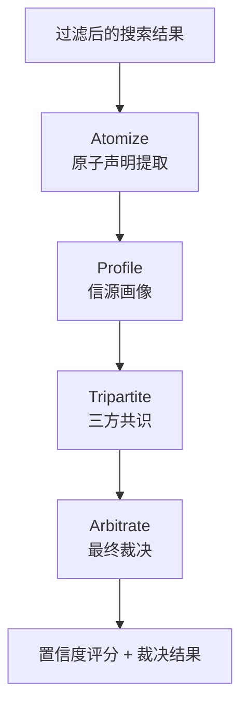
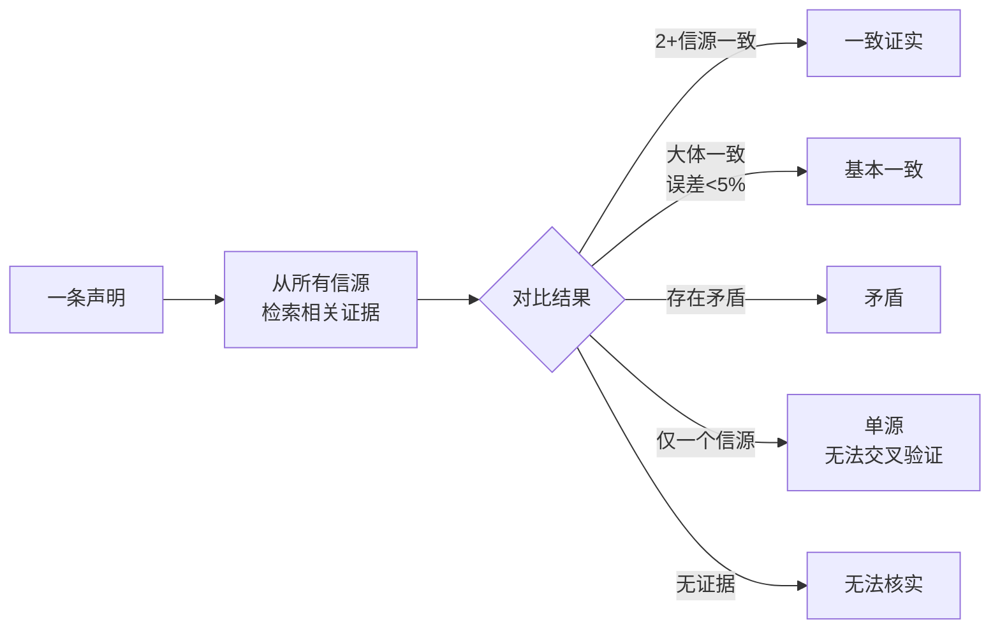

# 我给 AI 搭了个法庭，让它自己审自己

前面说到 TruthSeeker 的核心是"不直接相信搜索结果，而是交叉验证"。这篇文章展开讲这个最核心的模块——我管它叫"审判室"。

## 为什么需要这个？

先说说直接用 LLM 做搜索总结会出什么问题。我拿"Neuralink 首例人体植入后受试者出现感染"这个问题测试过好几次：

- DeepSeek 的回答：直接告诉你"是，发生了感染"，引用一个看起来像真的新闻标题
- 当你追问"来源是哪个媒体"，它可能给你编一个不存在的 URL
- 换一个问法"Neuralink 感染传闻是真的吗"，同一模型可能说"目前没有权威报道证实"

同一个模型，同一个问题，换个问法答案完全不同。这就是 LLM 的幻觉问题——它在生成"听起来对"的回答，而不是在验证事实。

所以我决定不信任任何单次 LLM 输出。我要的是：**从多个信源提取事实，对比它们的一致性，给出置信度评分**。

这就是 Verify Subgraph 的设计动机。

## 它怎么工作的：四个步骤



每一步都值得展开说。

### 第一步：Atomize（原子声明提取）

把一篇几千字的新闻稿变成一堆"一句话事实"。比如这篇 Neuralink 报道：

> "Neuralink 于 2024 年 1 月宣布完成首例人体脑机接口植入手术，受试者为一名因脊髓损伤而四肢瘫痪的患者。手术在斯坦福大学医学中心进行。然而术后数周，有报道称受试者出现了局部感染症状..."

拆成原子声明后：

```
声明 1：Neuralink 于 2024年1月完成首例人体植入 [primary]
声明 2：受试者是脊髓损伤导致的四肢瘫痪患者 [secondary]
声明 3：手术由斯坦福大学医学中心执行 [secondary]
声明 4：受试者术后出现感染症状 [primary][争议性声明]
```

每条声明标记重要级别（primary/secondary/indirect），并且记录来自哪个信源。这个拆解不是关键词匹配，而是由 LLM 来做的——因为同一事实在不同文章里的表述可能完全不同。

这里用的 LLM 是 **DeepSeek**。为什么选它而不是 OpenAI 的 GPT-4o 或者 Claude？几个现实原因：

1. **性价比。** DeepSeek 的 API 价格大概是 GPT-4o 的 1/10。深度研究模式一轮可能调用几十次 LLM（意图分析、过滤、Atomize、Profile、Tripartite、Arbitrate 各一次），如果每次调 GPT-4o，跑一次深度研究的推理成本可能就要好几块钱。DeepSeek 可以压到几毛钱。
2. **中文能力。** DeepSeek 的中文理解和生成质量在我实际测试里不输 GPT-4o，有些长文本场景甚至更好。毕竟我要分析的中文信源占多数。
3. **开源生态。** DeepSeek 的 API 兼容 OpenAI SDK 接口——一行 `base_url` 切换就能从 GPT-4o 切到 DeepSeek。不需要改任何调用代码，LangChain 的 `ChatOpenAI` 直接就能接 DeepSeek。

不过 DeepSeek 在英文信源的推理上确实不如 GPT-4o，尤其是涉及学术论文和专业术语的场景。所以核验子图里我留了个开关——用户可以在 Preset 里给不同阶段绑定不同模型，验证阶段可以用更强的模型（比如 DeepSeek Reasoner 或通义千问的推理专长模型），意图分析和搜索阶段用更便宜的模型。这个分段策略后面第 2 篇"三层配置模型"里讲过。


### 第二步：Profile（信源画像）

有了声明列表和它们来源的信源，接下来要判断**这些信源本身靠不靠谱**。LLM 会从几个维度给每个信源打分：

| 评分维度 | 看什么 |
|----------|--------|
| 内容质量 (0~1) | 信息密度、逻辑是否严密、有没有数据支撑 |
| 营销倾向 (0~1) | 是不是软文、有没有商业推广意图 |
| 专家引用 (0~1) | 有没有引用权威机构或专家 |

一个来自《自然》杂志的报道，内容质量可能 0.9，营销倾向 0.1。一个来自营销号的文章，内容质量可能 0.2，营销倾向 0.9。这些分数直接影响后面的裁决权重。

### 第三步：Tripartite（三方共识）

这一步是核心——对**每一条声明**，从所有信源中找相关的证据，判断一致性：



比如说"受试者术后出现感染"这条声明——如果 3 个不同信源都报道了，而且细节吻合，那就是 `Consistent`。如果一个说"感染"、一个说"无异常"、一个说"轻微不适"，那就是 `Contradictory`（矛盾）。

### 第四步：Arbitrate（最终裁决）

综合所有声明的验证结果和信源权重，给出裁决：

- **Supported（证实）**：多源一致支持，且信源质量过关
- **Contradicted（证伪）**：多源一致否定，或高权重信源否定
- **Unverifiable（无法核实）**：现有信源不足以判断

最终还会给一个全局置信度（verified → likely_true → disputed → uncertain → unverifiable）。

### 核验子图的技术实现：LangGraph Subgraph

整个核验流程是作为一个独立的 LangGraph Subgraph（子图）实现的，嵌套在主管道的 `cross_verify` 节点里。Subgraph 是 LangGraph 的一个重要特性——它让你把一段复杂逻辑封装成一个独立的状态机，对外就像一个普通的节点。

Subgraph 的好处：

1. **状态隔离。** 核验子图有自己的内部状态（`VerifyState`），不污染主图的 `ResearchState`。子图内部可以自由定义临时变量，比如每轮裁决的中间分数、信源画像的缓存结果——这些不需要暴露给主管道。
2. **可独立测试。** 我可以单独跑核验子图——给它一坨搜索结果，看它能不能正确提取声明、打分源、裁决。不用启动整个研究管道。这对调试非常有用。
3. **可替换。** 如果以后想换一套验证逻辑（比如不用法庭模型、改用别的图算法），只需要写一个新的 Subgraph 实现同一个输入/输出接口，主管道一行不改。

子图输入是过滤后的搜索结果列表，输出是附带置信度评分的声明列表。这个接口定义得很薄，所以核验子图可以独立演进——我现在就在实验给它加一个"事实验证"步骤，把声称的统计数据（比如"销售额增长了 30%"）交给专门的数值推理模型验证，跟文本声明分开处理。


## 这个设计的灵感来源

说实话，这个四步流程的思路是照搬的——**法庭审判模型**。

| 法庭里的角色 | Verify Subgraph 里的对应 |
|-------------|------------------------|
| 收集证据 | Atomize：把复杂信息拆成原子事实 |
| 评估证人可信度 | Profile：评估每个信源的质量 |
| 交叉质证 | Tripartite：让不同来源对同一个事实"对质" |
| 法官裁决 | Arbitrate：综合证据和权重做最终判断 |

我不是第一个把法庭模型用在信息验证上的人，但我觉得这个比喻特别好理解——每次跟别人解释这个模块，一说"我给 AI 搭了个法庭"，对方就秒懂。

## 一个真实走查

拿之前提过的 Neuralink 问题跑一次深度研究：

```
用户提问: "Neuralink 首例人体植入后受试者出现感染，真的假的？"

1. 意图分析拆成 3 个维度
2. 搜索返回 24 条结果
3. 粗过滤 + 精过滤后剩 7 条高质量结果
4. Atomize 从 7 条结果里提取了 12 条原子声明
5. Profile 给 7 个信源打了分（最高 0.91，最低 0.22）
6. Tripartite 对 12 条声明逐一对比：
   - 7 条被多源证实
   - 2 条矛盾（关于感染是否发生）
   - 3 条仅单源，无法验证
7. Arbitrate 裁决：
   - "首例人体植入于2024年1月" → Supported (4源一致)
   - "受试者出现感染" → Disputed (2源说有, 2源说无)
   - 全局置信度: disputed

结论：植入时间可以确认，感染问题存在矛盾报道，建议关注后续权威信源。
```

这个结果跟"直接问 ChatGPT 得到一个肯定/否定答案"相比，信息量完全不同。

---

> **已知不足**（POC 阶段）：信源画像模型用的是通用 LLM（DeepSeek），没有针对中文信源的权威性做专门微调，"内容质量"打分有时偏高——有些 AI 摘要类网站也被打高分，但其实是二手信息。原子声明提取有时会漏掉隐含的事实（比如文章暗示了但没说穿的因果关系）。裁决逻辑目前是加权平均，没有考虑信源之间的独立性问题——两个媒体可能都引用了同一个原始采访，但系统会当成两个独立信源来计票。预算有限，暂时没法用更强的推理模型（如 o1 级别）做裁决。

---

> **上一篇**：[LangGraph 管道：我把研究拆成了 6 个工人 ←](/blog/truthseeker/03-langgraph-pipeline)
> **下一篇**：[从一条队到三条队：我被用户骂醒了 →](/blog/truthseeker/05-worker-scheduler)