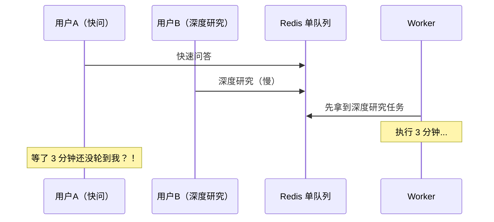
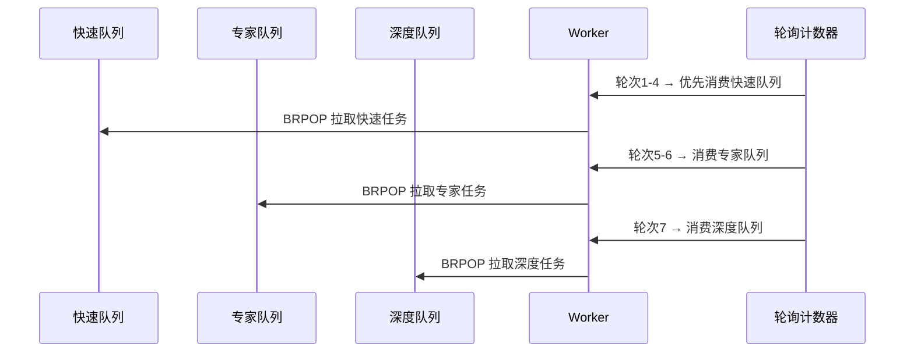

# 从一条队到三条队：我被用户骂醒了

## 最初只有一条队列

一开始我没想太多。用户提问题 → 后端收到请求 → 丢进 Redis 队列 → Worker 一个个执行。就一条队，先进先出。



然后问题来了。有朋友试用的时候问我："为什么查个天气都要等几分钟？"

一看日志，懂了。前面排了一个深度研究任务，跑了两三分钟。后面的快速问答全堵着。一条队的模式在"所有任务耗时差不多"的场景没问题，但快速问答几秒、深度研究几分钟——这就像超市结账只有一条队，你拿瓶水后面排着推两车货的人。

## 三条队 + 权重

于是拆成了三条队列，每条对应一个速度档位：

| 队列 | 对应模式 | 权重 | 含义 |
|------|----------|:---:|------|
| `ts:queue:fast` | 极速快问 | 4 | 每 7 次有机会被消费 4 次 |
| `ts:queue:expert` | 专家搜索 | 2 | 每 7 次 2 次 |
| `ts:queue:pipeline` | 深度研究 | 1 | 每 7 次 1 次 |

调度序列就是：

```
fast ×4 → expert ×2 → pipeline ×1 → 循环
```



每次 `BRPOP timeout 0.1s`，一个循环总共才 0.7 秒。这意味着：即使在深度研究的高负载下，快速问答最多等零点几秒就能被拿到。一个深度任务不会堵死整个系统。

## 为什么不严格优先级？

如果按严格优先级——快速队列有任务就绝不碰深度队列——那深度研究在高负载下可能永远排不上队。这叫"饥饿"。

加权轮询保证了深度任务也能被消费，只是频率更低。我觉得这更合理：深度研究的用户已经有了"这个要等几分钟"的预期，多等一小会儿可以接受。快速问答的用户没这个预期。

## 并发控制

拆了队列之后，新问题来了：一个 Worker 同时处理多少个任务？

一开始无限。结果 LangGraph 的图执行本身是异步的，事件循环被多个图执行占满，Worker 的 CPU 飙高，响应变慢。后来加了 `asyncio.Semaphore(2)`，单 Worker 最多同时跑 2 个任务。简单粗暴，但管用。

当前只有一个 Worker 进程。理想情况是多个 Worker 共享同一个 Redis 队列，水平扩展。但预算就够跑一台小机器，暂时没做多 Worker 的分布式调度。

### asyncio 的并发原语

这里用了两个 Python 标准库 `asyncio` 的并发原语——`Semaphore` 和 `Event`。如果你之前没写过 Python 的异步代码，这几个东西值得认识一下。

**`asyncio.Semaphore`** 是一个计数器，控制同时运行的协程数量。用法就两行：

```python
sem = asyncio.Semaphore(2)  # 最多 2 个协程同时跑

async with sem:
    await run_research_pipeline(task)  # 获取许可后才执行
```

当 2 个研究任务正在跑时，第 3 个任务在 `async with sem` 这行等，直到前面某个任务完成释放许可。这比线程锁简单——没有死锁风险，因为协程是协作式的，`await` 时自动让出控制权。

**`asyncio.Event`** 是一个布尔标志位，用于跨协程发信号。我在取消信号里用的：

```python
cancel_event = asyncio.Event()  # 默认 False

# 后台监听协程：收到取消信号时设置
cancel_event.set()  # → True

# 管道执行协程：每个节点前检查
if cancel_event.is_set():
    raise TaskCancelledError()
```

管道有十几个节点，每个节点前都 `if cancel_event.is_set()` 检查一次。一旦收到取消信号，当前节点跑完后下一节点直接抛异常退出。虽然不是秒级响应（当前节点必须跑完），但在不侵入 LangGraph 内部执行逻辑的前提下，这是能做到的最优雅的方式。


## Auto-Scaler：根据负载调整节奏

Worker 内有个独立协程，不断检查三个队列的总深度：

| 总深度 | 行为 | 
|--------|------|
| < 2 个任务 | 休眠 5 秒再轮询（省 CPU） |
| 2~10 个任务 | 休眠 3 秒 |
| > 10 个任务 | 休眠 1 秒（快速消费） |

没什么黑科技，就是三段 if-else。但有效——空闲时不浪费 CPU，繁忙时快速响应。

## 取消信号

用户点了"取消研究"，怎么通知正在跑的 Worker？不能直接杀进程，图执行到一半，得优雅终止。

方案是用 Redis PubSub：API 端发布一条取消消息到 `truthseeker:cancellations` 频道，Worker 后台有个协程一直监听着。收到信号后，设置一个 `asyncio.Event`，图执行的每个节点开始前检查这个 Event，如果被设置就抛出异常终止。

不算优雅，但在 LangGraph 的框架下没有更好的办法——图执行本身不支持从外部中断。

### 为什么用 ARQ 做 Worker

TruthSeeker 的 Worker 进程是基于 [ARQ](https://github.com/python-arq/arq) 搭建的。ARQ 是一个专门为 Python asyncio 设计的任务队列库，由 FastAPI 的作者 Samuel Colvin 开发——跟 FastAPI 和 Pydantic 是同一个人做的，生态兼容性天然好。

ARQ 跟 Celery 的对比：

| 维度 | ARQ | Celery |
|------|-----|--------|
| 异步模型 | 原生 asyncio，无阻塞 | 基于 prefork/thread pool |
| Redis 集成 | 直接 Redis List，极简 | Redis + 额外 broker 抽象层 |
| 配置复杂度 | 1 个 Worker 函数 + 1 行启动 | 多文件配置、beat scheduler |
| 适合场景 | 小到中型异步任务 | 大型分布式任务系统 |

选 ARQ 的理由跟选 FastAPI 一致——**够用且轻量。** Celery 功能强但太重，POC 阶段我需要的是一个能收 Redis 任务、异步执行、支持取消信号、支持优雅关闭的 Worker。ARQ 全满足了，而且只有几百行核心代码，出问题我能看懂。

ARQ 的 Worker 启动就用一个函数：

```python
# backend/worker.py
arq worker.run_worker(WorkerSettings)
```

`WorkerSettings` 里定义任务处理函数、Redis 连接、并发数。任务处理函数直接接受 `task_id` 等参数，内部调 LangGraph 管道执行。ARQ 自己处理了重试、超时、优雅关闭——不用我再造轮子。

## 进程级图编译缓存

Worker 每次处理任务都需要一个编译好的 LangGraph 图（包含 Checkpointer 和 Store 的 PostgreSQL 连接）。如果每次任务都重新编译，要重建连接池和拓扑结构，启动很慢。

所以做了个 `_graph_cache`，编译后缓存到进程级字典。同一个用户的同一个预设，直接复用已编译的图。缓存失效通过 Redis PubSub 广播：用户改了配置，API 端发广播，Worker 清缓存。

---

> **已知不足**（POC 阶段）：当前只有单 Worker，多 Worker 的分布式调度完全没设计，这意味着没法水平扩展。加权轮询的权重是拍脑袋定的（4:2:1），没有基于实际负载数据调优。取消信号依赖 Redis PubSub 的可靠性，但 PubSub 不保证送达——网络抖动时可能丢掉取消指令。理想情况应该用 Redis Stream 做可靠消息传递，但这块优先级不高一直没排上。

---

> **上一篇**：[我给 AI 搭了个法庭，让它自己审自己 ←](/blog/truthseeker/04-verify-subgraph)
> **下一篇**：[用户的 API Key 存在我这，我比他还怕泄露 →](/blog/truthseeker/06-multitenant-security)