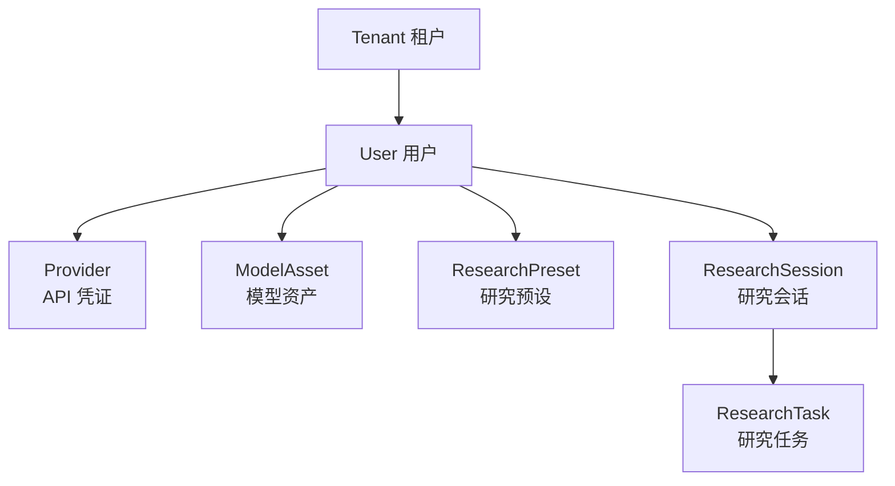

# 用户的 API Key 存在我这，我比他还怕泄露

做 SaaS 最让我焦虑的一件事：用户的 DeepSeek API Key、搜索引擎 API Key 都存在我的数据库里。人家信任你才填进来的，这要漏了怎么办？

这篇讲我做了哪些安全措施，以及哪些是我知道但还没做的。

## 数据隔离：每个人只能看到自己的东西

这个系统是多租户的。张三和李四的研究记录、API 配置互不可见。数据隔离靠的是四级实体链：



实现上很简单——所有 SQL 查询都带两个条件：

```sql
WHERE tenant_id = :tenant_id AND user_id = :user_id
```

`tenant_id` 和 `user_id` 从 JWT 里提取，API 中间件注入到请求上下文。不是靠前端传参（那不安全），是后端解析 Token 绑定的，没法伪造。

删除用户或租户时用外键 `ON DELETE CASCADE` 级联清掉所有关联数据，不留孤儿记录。

## API Key 加密：存进去的是乱码

用户填的 API Key 明文进不了数据库。入库前用 Fernet 加密——这是 Python `cryptography` 库里的一个对称加密方案，底层是 AES-128-CBC + HMAC-SHA256 签名。

简单说就是：

```
明文 API Key → AES 加密 → HMAC 签名 → base64 编码 → 存库
读取时 → base64 解码 → 验证 HMAC（防篡改）→ AES 解密 → 明文使用
```

加了 HMAC 意味着：即使有人黑了数据库、改了密文，解密时会因为签名对不上而直接报错。这不是加密性的问题，而是**防篡改**。

加密密钥默认从 `JWT_SECRET_KEY` 派生，但可以单独设 `ENCRYPTION_KEY` 环境变量。这样轮换加密密钥不影响已签发的 JWT Token——两者独立。虽然 POC 阶段还没真正轮换过，但接口留好了。

## SSRF 防护：Worker 不能访问内网

Worker 在跑研究时会去请求外部 URL（搜索引擎返回的网页）。如果有人提交了一个恶意研究，URL 指向 `http://169.254.169.254/metadata`（云服务器的元数据接口），Worker 如果傻傻去请求，就等于把服务器敏感信息送出去了。

这就是 SSRF（服务端请求伪造）。我做的防护是 DNS 级别的：

```
用户提交的 URL
  → socket.getaddrinfo() 解析成所有 IP 地址
    → 逐个检查每个 IP：
      127.0.0.0/8?       → 回环地址，拦截
      10.0.0.0/8?        → 私有地址，拦截
      172.16.0.0/12?     → 私有地址，拦截
      192.168.0.0/16?    → 私有地址，拦截
      169.254.0.0/16?    → 链路本地，拦截
      都通过 → 放行
```

有个特殊放行：`198.18.0.0/15`。这是 Clash 这类代理工具用的保留网段。我自己开发时跑 Clash 代理，不放行这个网段的话 Worker 根本访问不了外部 API。

## 密码存储

用户登录的密码用 PBKDF2-SHA256 哈希，48 万轮迭代。这个轮数是我在"安全"和"登录速度"之间取的平衡——太少容易暴力破解，太多登录时算哈希要等。

验证密码时用 `hmac.compare_digest()` 做常量时间比较——不管你输的密码对不对，比较时间一样长。防止攻击者通过"错误密码比正确密码返回更快"这种旁路信息推断密码。

## 身份认证

支持两种登录方式：传统的用户名密码，以及 Logto OIDC（OpenID Connect）。

OIDC 的接入不复杂：后端从 Logto 的 JWKS 端点拿公钥，校验 Token 的 RS256 签名。前端用 Logto SDK 完成跳转登录流程。两种方式并存的理由是——我自己用密码登录省事，给别人演示的时候用 OIDC 显得正规。

---

> **已知不足**（POC 阶段）：SSRF 防护是 DNS 级别的，有绕过可能性——比如攻击者用 DNS Rebinding（先返回合法 IP、后返回内网 IP），或者用 HTTP 重定向到内网地址。生产级做法应该用代理隔离（Worker 请求外部 URL 时走一个独立的 HTTP 代理，代理那边做网络隔离）。另外，API Key 加密用的 Fernet 是固定密钥，没有做密钥轮换策略。日志里目前没有脱敏，有些错误日志可能会把解密后的 API Key 打印出来——这个必须修。多租户的数据库隔离靠 WHERE 条件，没有做更严格的 Row-Level Security（PG 原生 RLS），万一有个查询忘了带 WHERE 条件就跨租户泄露了。

---

> **上一篇**：[从一条队到三条队：我被用户骂醒了 ←](/blog/truthseeker/05-worker-scheduler)
> **下一篇**：[十分钟加一个搜索引擎的重构过程 →](/blog/truthseeker/07-search-plugin)