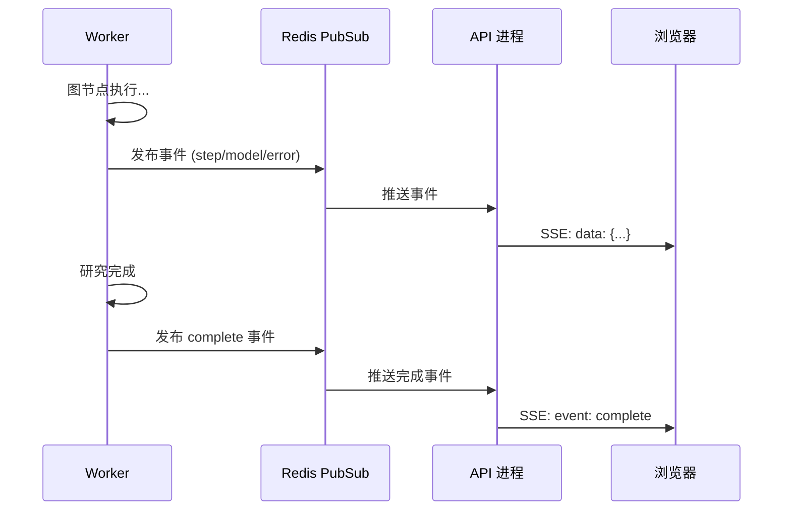
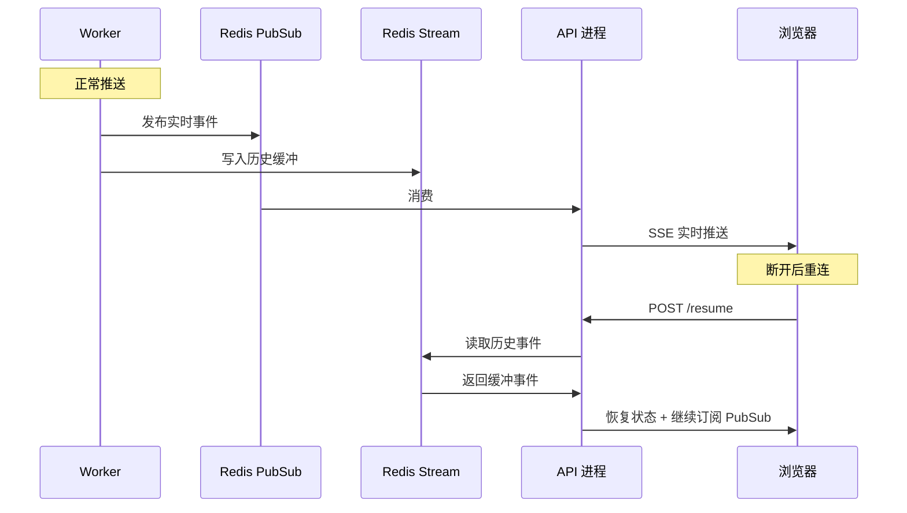

# 让用户盯着白屏等 5 分钟，这不行

## 最开始的版本有多糟糕

第一版做完深度研究功能的时候，用户体验是这样的：

1. 用户点"开始研究"
2. 界面卡住
3. 3-5 分钟后，突然蹦出一大段结果

中间这段时间用户在干嘛？盯着一个转圈，不知道系统死了没有、AI 在干嘛、还剩多久。说实话，我自己用了一次都觉得难受。

所以我给自己定了目标：**研究管道的每一步都要让用户看到。** 这在技术上的叫法是 SSE（Server-Sent Events），从后端单向推送事件给前端。

## 第一版：最简单的轮询

最开始我偷懒，没用 SSE。API 返回一个 `task_id`，前端每隔 2 秒 `GET /task/{id}/status` 看进度。

问题很明显：2 秒的轮询间隔产生大量无效请求，而且进度更新的颗粒度太粗——只有当管道一个完整节点跑完，状态才会更新到数据库。用户看到的是"进度条跳了一大截"，不是平滑的。

## 第二版：Redis PubSub 实时推送

轮询不行，换成了正经的 SSE。基本思路：

```
Worker 执行 LangGraph 图
  → 每个节点产生事件
  → 发布到 Redis PubSub
  → API 进程订阅 PubSub
  → 格式化为 SSE 推给浏览器
```



前端收到了实时的事件流，用户体验好了太多——你能看到意图分析在跑、搜索在进行、验证在对比信源、报告在生成。进度条不再是跳变，而是跟着事件走。

## 事件类型

我定义了几种事件：

| 事件 | 什么时候发 | 前端干嘛 |
|------|-----------|----------|
| `step` | 进入一个新管道阶段 | 更新进度条和思考链面板 |
| `model` | LLM 流式输出 Token | 追加到消息（打字机效果） |
| `complete` | 研究完成 | 展示报告和声明验证卡片 |
| `error` | 任何节点报错 | 显示错误提示 |
| `sync` | 断线重连时 | 恢复完整状态 |

## 最大的坑：断线重连

这是 SSE 方案踩过最深的一个坑。**Redis PubSub 不保存历史消息**——一旦浏览器断线（关了标签页、网络抖动），断开期间的事件全丢了。

比如研究已经跑了 2 分钟，用户关了标签页再打开。重新订阅 PubSub 之后，前面的 `step` 和 `model` 事件都没了，前端看到的是一个"空状态重生"——进度条突然从 0 跳到 80%，之前的思考过程全没了。

修复方案是双通道：



- **Redis PubSub**：正常连接时用，零延迟实时推送
- **Redis Stream**：当"历史缓冲区"用，断线重连时从这里补全丢失的事件

重连流程：前端调 `POST /api/v1/chat/resume` → API 从 Redis Stream 读取该研究的所有历史事件 → 推送给前端 → 前端重建完整状态 → 继续从 PubSub 消费新事件。

## 关键配置细节

Nginx 那边有几个必须加的配置，不然 SSE 根本跑不起来：

```nginx
proxy_buffering off;       # 关缓冲，确保事件即时推送
proxy_read_timeout 86400s; # 长连接超时 24h，深度研究慢
proxy_cache off;           # 禁用缓存
```

第一次没加 `proxy_buffering off`，前端收到的事件是"攒一波再推"——每隔 30 秒刷一大段，完全没有实时感。排查了半天才发现是 Nginx 默认开了代理缓冲。

## 事件解析器

LangGraph 的原生事件很杂——`on_chat_model_stream`、`on_chain_start`、`on_chain_end`、`on_tool_start`... 几十种事件类型，直接推给前端前端没法处理。

写了个事件解析器（Parser），把这些原始事件归并成前面那 5 种 SSE 事件。核心就一个函数：`parse_graph_event(raw_event) → SSEEvent | None`。

---

> **已知不足**（POC 阶段）：SSE 断线重连的 Stream 回溯逻辑在生产环境还没大规模压测过——目前只有我自己在用小流量测试。Node.js 的 EventSource API 对重连有一些内置策略，但前端这边没有针对"恢复失败"做降级处理（比如回退到轮询）。事件解析器目前靠一堆 if-else 匹配事件类型，随着 LangGraph 版本升级事件格式可能会变，不够健壮。最理想的状态是把 Parser 做成可配置的事件映射表，但目前没时间做。

---

> **上一篇**：[十分钟加一个搜索引擎的重构过程 ←](/blog/truthseeker/07-search-plugin)
> **下一篇**：[一行命令跑起来：Makefile 踩坑实录 →](/blog/truthseeker/09-deployment)