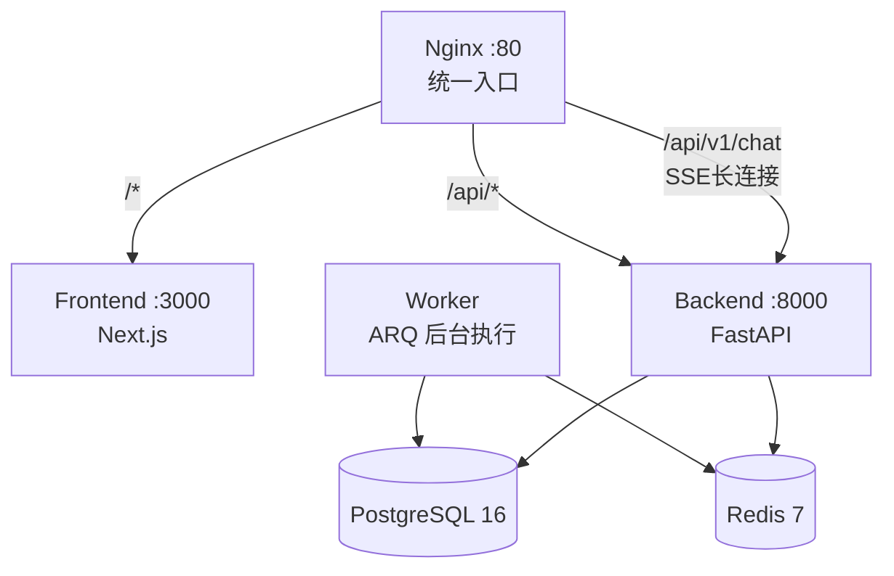

# 一行命令跑起来：Makefile 踩坑实录

这是这个系列最后一篇，讲部署。不是讲 Kubernetes 那种高大上的，就是我一个人怎么用 Docker Compose 把这一堆服务跑起来。

## 目标：让没写过 Python 的人也能跑

我对部署的要求很简单：随便谁 git clone 下来，敲一个命令，所有东西跑起来。不需要装 Python、不需要装 Node、不需要装 PG、不需要装 Redis。Docker 就够了。

最终的 docker-compose.yml 编排了 6 个服务：



对外只暴露 80 端口，剩下全是容器间内部通信。

## 为什么不用 K8s？

一个人运维，Kubernetes 太重了。光是写 Deployment、Service、Ingress、ConfigMap、Secret 就得半天，调试网络策略又要半天。Docker Compose 一条 `docker compose up -d` 就搞定了。

**但这个选择有代价。** 没有健康检查自动重启（Docker 的 restart policy 太基础）、没有滚动更新（更新就得 down + up）、没有资源限制细粒度控制。这些在 POC 阶段都能忍，但有真实用户之后必须得补。

## Nginx 的坑：SSE 长连接

这篇可能是整个系列里坑最多的。挑几个记忆犹新的说。

### 坑 1：Nginx 默认 60 秒超时

SSE 是一个长连接——深度研究可能要跑几分钟甚至更久，HTTP 连接必须一直开着。但 Nginx 的 `proxy_read_timeout` 默认是 60 秒。结果就是研究跑了一分钟多，连接断了，前端收不到后续事件。

修复：

```nginx
proxy_read_timeout 86400s;  # 24 小时，够了吧
```

### 坑 2：代理缓冲导致事件延迟

第一篇讲 SSE 时提过这个。Nginx 默认会缓冲上游响应，攒够了再发给客户端。这对普通 HTTP 响应是优化，对 SSE 是灾难——用户看到的是每隔几十秒才刷一段。

修复：

```nginx
proxy_buffering off;
proxy_cache off;
```

## Docker 容器间的 DNS

Docker Compose 里服务间通信用服务名当主机名，比如后端连 PostgreSQL 用 `postgres:5432` 而不是 `localhost:5432`。

但本地开发（不用 Docker）连的是 `localhost:5432`。所以我准备了两套环境变量模板：

| 模板 | 数据库地址 | Redis 地址 | 什么时候用 |
|------|-----------|-----------|-----------|
| `.env.example` | `localhost:5432` | `localhost:6379` | 本地 `uv run main.py` |
| `.env.docker.example` | `postgres:5432` | `redis:6379` | `docker compose up` |

第一次部署的人经常用错模板——复制了 `.env.example` 到 `.env` 就 `docker compose up`，然后发现后端连不上数据库。后来在 `make deploy` 里加了检查：如果检测到 `.env` 里的数据库主机名不是 `postgres` 就警告。

## 数据库迁移时机

应用服务（Backend、Worker）启动前必须先跑完数据库迁移，否则表都不存在。Docker Compose 里用 `depends_on` + `healthcheck` 解决：

```yaml
backend:
  depends_on:
    postgres:
      condition: service_healthy  # PG 就绪后才启动
```

但 `depends_on` 只等容器启动，不等服务就绪——PG 容器启动了但数据库还没接受连接时，后端启动就会报错。所以加了 `healthcheck`：

```yaml
postgres:
  healthcheck:
    test: ["CMD-SHELL", "pg_isready -U truthseeker"]
    interval: 5s
```

## Makefile：给自己省时间

部署命令记不住，每次都要翻 README。所以写了个 Makefile：

```makefile
deploy:
	docker compose up --build -d

down:
	docker compose down

logs:
	docker compose logs -f

clean:
	docker compose down -v  # ⚠️ 删数据
```

`make clean` 尤其危险——加 `-v` 会删掉所有数据卷，包括 PostgreSQL 里的所有用户和研究记录。我在注释里加了警告，但说实话我自己踩过这个坑——想"清理一下"结果把自己测试数据全清掉了。

## 多阶段构建：省镜像体积

前端 Dockerfile 用三阶段构建：

```
Stage 1 (deps)：   安装依赖（npm ci）
Stage 2 (builder)：生产构建（next build）
Stage 3 (runner)： 只复制构建产物 + 运行时依赖
```

最终镜像里不包含 `node_modules` 的开发依赖和源码，体积从 2GB+ 压到 300MB 左右。对个人项目来说意义不大（镜像大点也能跑），但算是一个好习惯。

---

> **已知不足**（POC 阶段）：部署方案就是单机 Docker Compose，没有容器编排（K8s/Nomad）、没有监控告警（Prometheus/Grafana）、没有日志聚合（ELK/Loki）、没有灰度发布策略。SSL 终止依赖外部（Cloudflare），没有在 Nginx 层配证书。数据库备份靠手动 `pg_dump`，没有自动备份策略。健康检查目前只有一个 `/health` 端点检测 PG 连接，没有更深度的探活（比如图编译是否正常、LLM API 是否可达）。这些都是 POC 阶段故意欠的债——要加的话开发时间得翻倍，但我一个人时间就这么多。

---

> 📖 **返回**：[博客首页 ←](/blog/)
